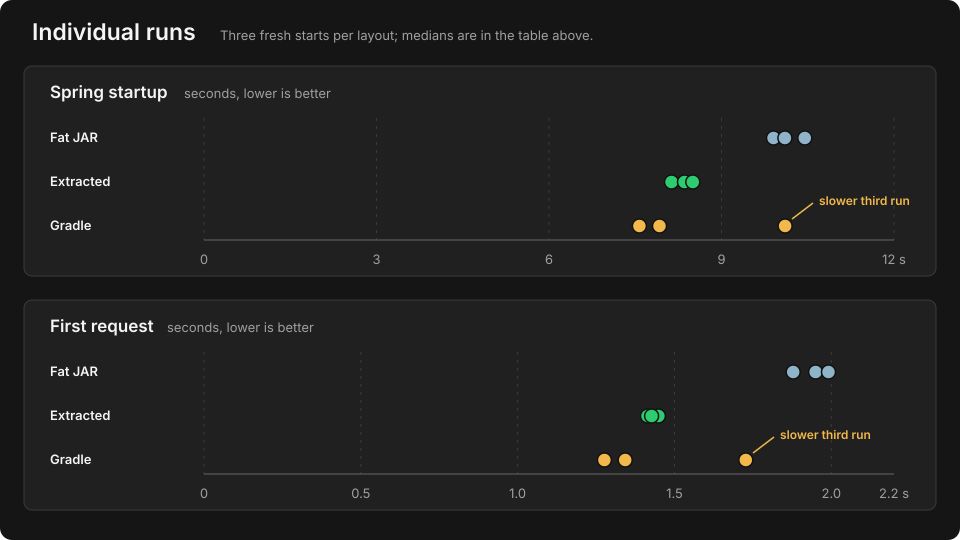

# Spring Boot fat JAR vs extracted layout vs Gradle application distribution

A small exploratory comparison of three ways to launch the same Spring Boot
application:

- Spring Boot executable fat JAR
- Spring Boot `jarmode=tools` extracted layout
- Gradle `application` plugin distribution using `installDist`

This is not a Maven-versus-Gradle benchmark. It asks whether moving
dependencies out of Spring Boot's nested executable-JAR layout changes startup
and first-request latency.

## Result

Three fresh starts per layout were run on the same Alpine VM with Spring Boot
4.1.1, OpenJDK 25.0.4, and the same JVM profile.

| Layout | Median startup | Median first request |
|---|---:|---:|
| Fat JAR | 10.103 s | 1.950 s |
| Extracted layout | 8.357 s | 1.427 s |
| Gradle application distribution | 7.921 s | 1.343 s |

Both filesystem-based layouts were faster than the executable fat JAR in this
quick run. Gradle had the lowest medians, but the generated artifacts,
dependency ordering, and launch paths were not byte-identical. The third
Gradle start was noticeably slower than its first two, so the Gradle-versus-
extracted difference is directional rather than conclusive.

See [RESULTS.md](RESULTS.md) for every captured measurement.



## Build the Gradle distribution

Use Java 25 and a Gradle version that supports running on Java 25, such as
Gradle 9.1.0:

```sh
gradle --no-daemon clean installDist -x test
```

The generated application distribution is:

```text
build/install/stars-gradle/
```

It contains `bin/stars-gradle`, `lib/stars-gradle.jar`, and the dependency
JARs. The generated launcher invokes `pvrlabs.StarsApplication` with a
conventional filesystem classpath.

The copied `app/` fixture contains the source, deterministic experiment
profile, reset helper, and seed SQL. The complete constrained-VM harness and
raw run archive are kept in the private working experiment.
