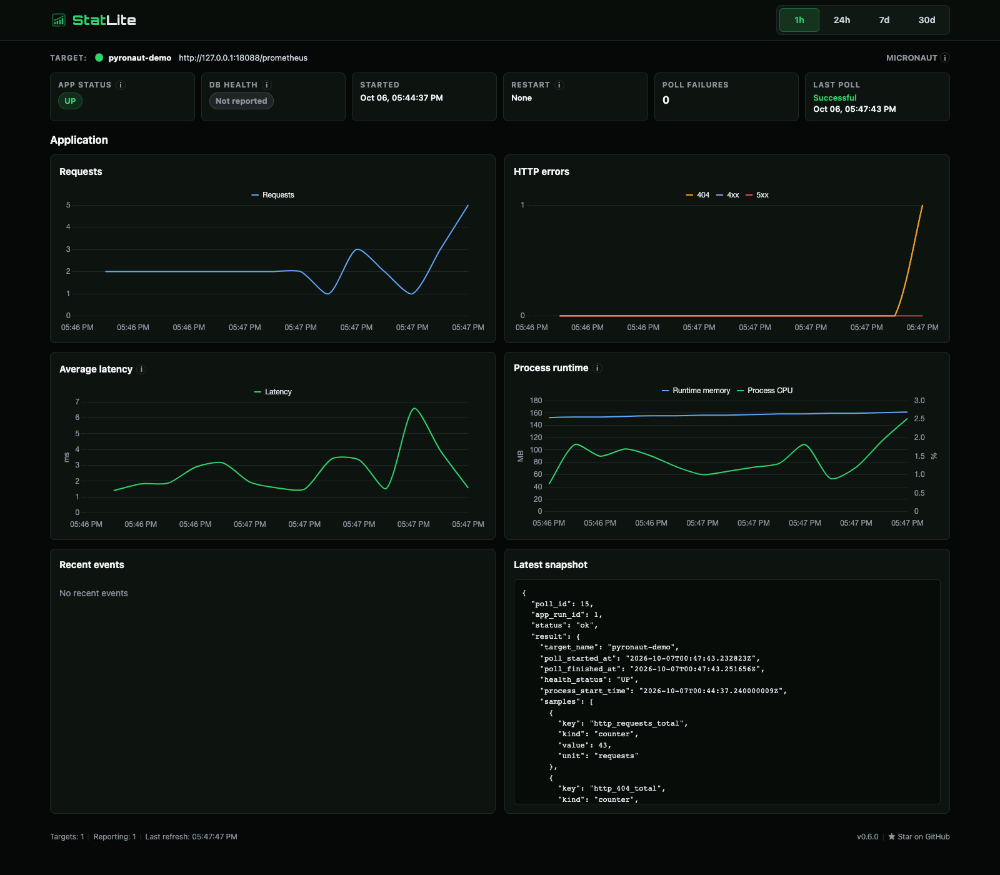

# Can StatLite monitor a Pyronaut Python app?

## Question

Can StatLite's existing Micronaut integration monitor a Python application
built with Pyronaut without any StatLite changes?

## Setup

| Component | Version |
| --- | --- |
| Pyronaut CLI | 0.1.0 |
| Micronaut Core / Platform | 5.2.14 / 5.2.1 |
| Micronaut Micrometer / Micrometer | 6.1.0 / 1.17.1 |
| GraalPy | 25.4.4.1.1 (Python 3.13.14) |
| GraalVM CE / JDK | 25.4.4.1.1 / 25.0.4.1.1 |
| StatLite | 0.6.0 (released) |
| Runtime environment | Docker 29.5.2, Ubuntu 24.04.4, x86_64 |

The [Pyronaut CLI](https://pyronaut.io/docs/) generated a minimal JVM-mode app.
The [Micronaut Micrometer guide](https://micronaut-projects.github.io/micronaut-micrometer/latest/guide/)
documents the management and Prometheus registry dependencies and configuration
used here.

## Test

1. Start the tiny Pyronaut app in [`app/`](app/) with a deterministic `/hello`
   response.
2. Enable the standard Micronaut management, health, and Micrometer Prometheus
   endpoints.
3. Request `/hello` several times and request a missing path to materialize a
   404 series; inspect `/prometheus` and `/health`.
4. Point released StatLite at the app with the ordinary Micronaut target below
   and collect every five seconds for about a minute.

```yaml
targets:
  - name: pyronaut-demo
    type: micronaut
    url: http://127.0.0.1:18088/prometheus
```

See StatLite's [Micronaut target documentation](https://github.com/PVRLabs/statlite/blob/main/docs/targets/micronaut.md)
for the released target syntax.

## Result

**PASS.** `/hello` returned `Hello from Pyronaut`; `/health` returned
`{"status":"UP"}`. StatLite 0.6.0 detected `Micronaut Metrics`, reported
compatibility, and collected 15 successful polls with health `UP` and no poll
failures. It recognized all nine supported signals:

- `http_requests_total`, `http_404_total`, `http_4xx_total`, `http_5xx_total`
- `http_request_time_total_seconds`
- `process_cpu_usage`, `jvm_heap_used_bytes`
- `process_start_time`, `process_uptime`

HTTP counters and duration accumulated after traffic. The raw Micrometer HTTP
timer was a `summary` with the expected `_count`/`_sum` names; `/hello` and 404
series carried the expected method/status/URI/exception labels.



## Why it works

With the normal Micronaut management and Micrometer Prometheus dependencies
and endpoint configuration enabled, Python applications built with Pyronaut
can use StatLite's existing Micronaut integration without StatLite-specific
instrumentation or collector changes. This fixture explicitly enabled those
dependencies and configured `/prometheus` and `/health`; the app exposed
standard Micronaut/Micrometer Prometheus metrics that StatLite already
understands.

## Caveat

This demonstrates compatibility for Pyronaut applications, not Python
applications generally; it says nothing about FastAPI, Django, Flask, or other
frameworks. The JVM CPU, heap, start-time, and uptime metrics describe the
underlying JVM/GraalPy process. `jvm_heap_used_bytes` is not separate Python
interpreter heap usage.
