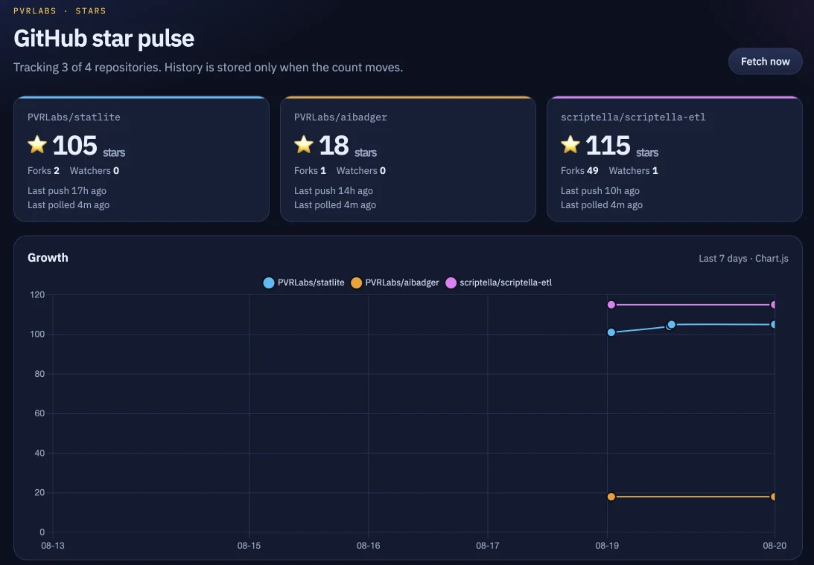

# Star Pulse

Minimal Spring Boot demo that tracks GitHub star growth for up to 4 repositories and plots the history on a single dashboard.

Package: `pvrlabs` (no `com`).



## Requirements

- **Linux box (run only):** Java 21 JRE. No Maven.
- **From source (optional):** JDK 21 and `mvn-lite` (wraps Maven 3.9+)

No external database or message broker. History lives in an embedded H2 file at `./data/starsdb`.

## Install on Linux (zip + Java, no Maven)

The target machine does **not** need Maven. Ship the fat JAR, unzip, run with `java`.

### 1. Install Java 21 on the Linux box

Debian / Ubuntu:

```bash
sudo apt update
sudo apt install -y openjdk-21-jre-headless
java -version
```

RHEL / Fedora / Amazon Linux:

```bash
sudo dnf install -y java-21-openjdk-headless
java -version
```

`java -version` must report 21.

### 2. Pack the app (on a machine that already has the JAR)

```bash
mkdir -p /tmp/stars-app
cp target/stars-0.0.1-SNAPSHOT.jar /tmp/stars-app/stars.jar
cp run.sh /tmp/stars-app/
chmod +x /tmp/stars-app/run.sh
cd /tmp && zip -r stars-app.zip stars-app
```

Copy `stars-app.zip` to the Linux box (`scp`, USB, etc.).

If you do not have `target/stars-0.0.1-SNAPSHOT.jar` yet, build it once on a machine with Maven (`mvn-lite -DskipTests package`). Do not run Maven on the Linux box.

### 3. Unpack and run

```bash
unzip stars-app.zip
cd stars-app

# optional
export APP_GITHUB_REPOS=PVRLabs/statlite,PVRLabs/aibadger,scriptella/scriptella-etl
export GITHUB_TOKEN=          # leave empty if you have no token

./run.sh
```

Or without the script:

```bash
java -Xms16m -Xmx64m -Xss256k -XX:+UseSerialGC -jar stars.jar
```

Open `http://<that-box>:8080`.

H2 writes `./data/` next to the JAR. Keep that folder if you want history to survive restarts.

### 4. Stay up after logout (optional)

```bash
nohup java -Xms16m -Xmx64m -Xss256k -XX:+UseSerialGC -jar stars.jar > stars.log 2>&1 &
```

Or a systemd unit at `/etc/systemd/system/stars.service`:

```ini
[Unit]
Description=Star Pulse
After=network.target

[Service]
User=stars
Group=stars
WorkingDirectory=/opt/stars-app
ExecStart=/usr/bin/java -Xms16m -Xmx64m -Xss256k -XX:+UseSerialGC -jar /opt/stars-app/stars.jar
Restart=on-failure
Environment=APP_GITHUB_REPOS=PVRLabs/statlite,PVRLabs/aibadger,scriptella/scriptella-etl
# Environment=GITHUB_TOKEN=your-token

[Install]
WantedBy=multi-user.target
```

```bash
sudo id -u stars >/dev/null 2>&1 || sudo useradd --system --user-group --home-dir /opt/stars-app --shell /usr/sbin/nologin stars
sudo mkdir -p /opt/stars-app
sudo unzip -o stars-app.zip -d /opt
sudo chown -R stars:stars /opt/stars-app
sudo systemctl daemon-reload
sudo systemctl enable --now stars
```

Do not unzip and try to `mvn-lite` on that box. There is nothing to compile, only the configured `java -Xms16m -Xmx64m -Xss256k -XX:+UseSerialGC -jar stars.jar` launch.

## Run from source

```bash
mvn-lite package
./run.sh
```

Or:

```bash
mvn-lite spring-boot:run
```

Then open [http://localhost:8080](http://localhost:8080).

`run.sh` and `mvn-lite spring-boot:run` use `-Xms16m -Xmx64m -Xss256k -XX:+UseSerialGC`.

```bash
mvn-lite test
```

## What you get

- **Summary cards** for each tracked repo: stars, forks, watchers, last push, and last polled
- **Chart.js** line chart with one color-coded series per repository
- **Fetch now**: POST `/refresh` to run one poll cycle immediately
- Background poll every **5 minutes** (`fixedRate = 300000`, first run after a 3s delay)
- **Actuator**: health, info, and Micrometer metrics at `/actuator`

## Actuator

No extra process. Hit these on the same port as the dashboard:

| URL | What |
|---|---|
| `/actuator/health` | app + DB status (`UP` / `DOWN`) |
| `/actuator/health/liveness` | process is running |
| `/actuator/health/readiness` | ready for traffic |
| `/actuator/info` | app name / package |
| `/actuator/metrics` | list of meter names (JVM, Tomcat, Hikari, process) |
| `/actuator/metrics/jvm.memory.used` | heap/non-heap |

```bash
curl -s http://localhost:8080/actuator/health
curl -s http://localhost:8080/actuator/metrics/jvm.memory.used
```

Only `health`, `info`, and `metrics` are exposed. Heap dump, env, and beans stay off.

## Monitor with StatLite

[StatLite](https://github.com/PVRLabs/statlite) polls this app’s Actuator endpoints. Start Star Pulse first, then from this directory:

```bash
statlite --config ./statlite.yaml
```

Dashboard: [http://127.0.0.1:9091](http://127.0.0.1:9091)

`statlite.yaml` watches `star-pulse` at `http://127.0.0.1:8080/actuator` and StatLite itself. Poll interval is 30s. SQLite history is `./statlite-stars.sqlite` (gitignored).

## Configuration

Set repos in `src/main/resources/application.properties` or with an environment variable. Extra entries beyond 4 are ignored.

```properties
app.github.repos=PVRLabs/statlite,PVRLabs/aibadger,scriptella/scriptella-etl
```

```bash
export APP_GITHUB_REPOS=owner/one,owner/two
export GITHUB_TOKEN=your-token   # optional; raises the unauthenticated 60 req/hour cap
```

| Property | Default | Notes |
|---|---|---|
| `app.github.repos` | the three repos above | comma-separated `owner/name`, max 4 |
| `app.github.token` | `${GITHUB_TOKEN:}` | sent as `Authorization: Bearer` when set |
| `app.github.api-base-url` | `https://api.github.com` | override for tests |
| `server.tomcat.threads.max` | `10` | low-RAM Tomcat |
| `server.port` | `8080` | |

Unauthenticated GitHub allows **60 requests/hour**. Four repos every 5 minutes is 48/hour, which leaves room for startup and **Fetch now**. A `304` from `If-None-Match` skips the body but **still counts** unless you set `GITHUB_TOKEN` (GitHub only waives the quota for authenticated conditional requests).

## Polling rules

On every successful GitHub response (including 304):

1. Update `projects.last_polled_at`
2. Append a `star_history` row **only if** `stargazers_count` differs from the last stored value

Failed fetches are logged and skipped so one bad repo does not abort the cycle.

## Schema (H2)

Hibernate creates the tables on startup (`spring.jpa.hibernate.ddl-auto=update`).

**`projects`**

| Column | Type |
|---|---|
| `id` | PK, auto-increment |
| `repo_name` | `VARCHAR`, unique (`PVRLabs/statlite`) |
| `current_stars` | `INT` |
| `current_forks` | `INT` (snapshot only) |
| `current_watchers` | `INT` (`subscribers_count`) |
| `last_pushed_at` | `TIMESTAMP` |
| `last_polled_at` | `TIMESTAMP` |

**`star_history`**

| Column | Type |
|---|---|
| `id` | PK, auto-increment |
| `project_id` | FK → `projects.id` |
| `star_count` | `INT` |
| `recorded_at` | `TIMESTAMP` |

H2 console: [http://localhost:8080/h2-console](http://localhost:8080/h2-console)

- JDBC URL: `jdbc:h2:file:./data/starsdb`
- User: `sa`
- Password: *(empty)*

## Layout

```
src/main/java/pvrlabs/
  StarsApplication.java
  config/          # GithubProperties, RestClient
  github/          # public REST client + ETags
  model/           # Project, StarHistory
  poll/            # scheduler + per-repo transaction writer
  repository/
  web/             # Thymeleaf dashboard + Chart.js payload
src/main/resources/templates/index.html
```
