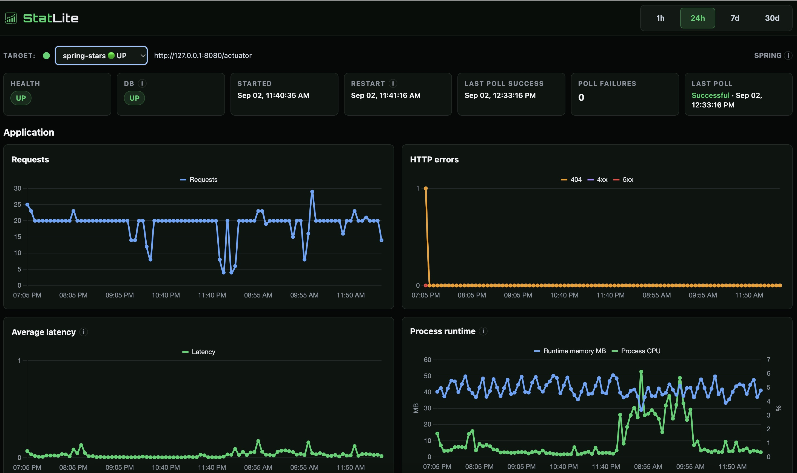
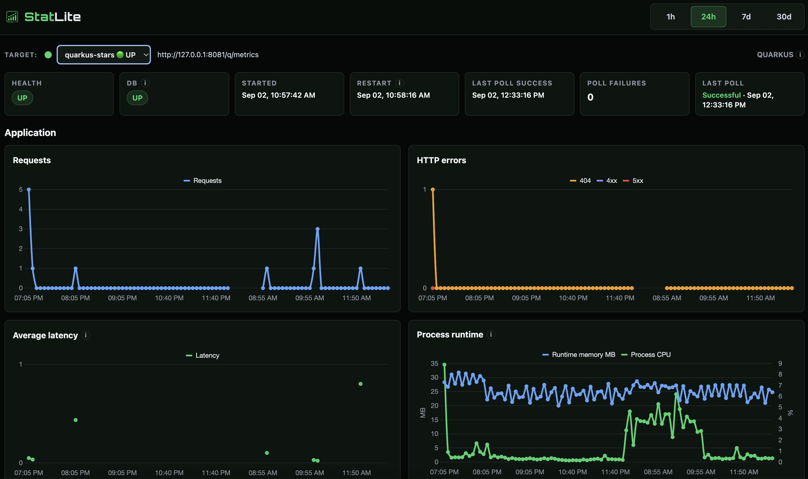
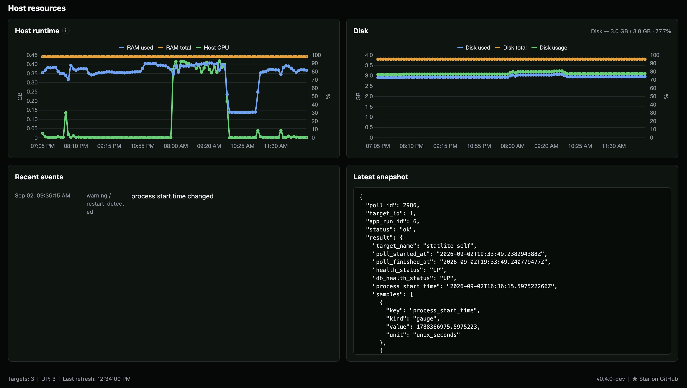

# Spring Boot vs Quarkus on a 512 MB VPS

I have been adding Quarkus support to StatLite, my lightweight self-hosted
metrics dashboard. StatLite already monitors Spring Boot applications, so I
put equivalent Spring Boot and Quarkus applications side by side to exercise
both integrations and see how they behaved on a genuinely small server.

The setup was intentionally demanding: the same small Star Pulse workload, the
same JDK 25 build, the same `Xmx80m` JVM profile, and the same virtual machine
with 512 MiB of configured RAM and 256 MiB of swap. One StatLite process
monitored both applications and the host.

The short version is not that one framework simply uses more memory everywhere.
Quarkus started larger in this workload, then developed a smaller resident
working set and smaller JVM heap under sustained pressure. RSS alone was
misleading because Linux was paging Quarkus more aggressively. In a later
follow-up, the machine eventually ran out of memory and swap, and Spring was
selected as the OOM victim.

> The [published experiment record](https://github.com/PVRLabs/experiments/tree/main/statlite/spring-vs-quarkus) contains the exact JVM flags and versions, selected RSS/PSS/VmSwap measurements, package-maintenance findings, OOM kernel evidence, selected checkpoints, restart chronology, methodology, and limitations. Full measurement archives, databases, raw service journals, and other private capture metadata remain outside the public package.

## The setup

Both applications served the same Star Pulse workload. Every five minutes they
fetched star, fork, and watcher counts for the same three GitHub repositories
and stored the results in H2.

| | Spring Boot | Quarkus |
| --- | --- | --- |
| Framework | Spring Boot 3.5.5 | Quarkus 3.39.1 |
| Runtime | JDK 25.0.4 | JDK 25.0.4 |
| Heap limit | `-Xmx80m` | `-Xmx80m` |
| Database | H2 | H2 |
| Metrics | Actuator Prometheus | Prometheus/OpenMetrics |

The VM was Ubuntu 24.04 with one vCPU. The guest exposed 452 MiB of RAM, with
256 MiB of persistent swap. Both JVMs also used the same 16 MiB initial heap,
256 KiB thread stacks, Serial GC, tiered compilation stopped at level 1, a
32 MiB reserved code cache, and compact object headers. This was a JVM-mode
comparison, not a native-image comparison.

## Quarkus started larger

At the settled checkpoint in the memory-residency follow-up, Spring Boot was
about 112 MiB RSS and Quarkus was about 145 MiB. That was the first surprise:
the framework commonly associated with small deployments had the larger
resident process at startup.

That result was not enough to explain the longer observation. Startup memory
and resident memory after sustained pressure are different measurements.

## The relationship reversed under pressure

The supporting memory-residency follow-up recorded the same processes at the
settled checkpoint and after an hour:

| Framework | Settled RSS | 60-minute RSS | 60-minute JVM heap used | 60-minute swap residency |
| --- | ---: | ---: | ---: | ---: |
| Spring Boot | ~112 MiB | ~154 MiB | ~50.3 MB | ~66 MiB |
| Quarkus | ~145 MiB | ~83 MiB | ~33.1 MB | ~91 MiB |

Quarkus's RSS fell substantially, but its heap did not fall with it. Its heap
grew from about 28.0 MB to 33.1 MB while its swapped memory grew from about
29 MiB to 91 MiB. Linux paging therefore explains an important part of the
apparent RSS advantage.

Even with that qualification, Quarkus had the smaller heap and the smaller
resident working set at the relevant comparison point. Spring moved in the
opposite direction, with a larger later RSS and heap in this workload.

This is a workload-specific observation on an extremely constrained VM. It is
not a claim that Quarkus always uses 83 MiB or that Spring Boot always uses
154 MiB.

## The 512 MB limit

The VM first exhausted its tight memory and swap margin during later Ubuntu
package maintenance. Spring was OOM-killed, and the package restart handling
also restarted the application services. That demonstrated how little headroom
the machine had for routine operating-system work.

The stronger result came afterward. Once the obvious package-maintenance
pressure had cleared, Spring and Quarkus were started again with the same JDK
25 and `Xmx80m` configuration. A fresh one-hour observation began. About
41 minutes later, swap was again effectively exhausted and the kernel
OOM-killed Spring. Spring restarted automatically. Quarkus and StatLite did
not restart, and the final health checks were successful.

The later OOM was not caused by the active `apt` transaction seen earlier. It
also should not be read as proof that no other operating-system activity
contributed to the final memory state. The defensible conclusion is that the
512 MiB RAM and 256 MiB swap configuration did not provide enough overall
headroom to guarantee reliable survival of both JVM applications for an hour.

## StatLite stayed small and kept watching

StatLite remained a small part of the system, at roughly 10 to 15 MiB RSS in
the relevant checkpoints. It continued monitoring through the Spring restart,
recorded the temporary health failure, and observed recovery. Quarkus and
StatLite stayed available while Spring was being restarted.

The application workload also encountered unauthenticated GitHub rate limits.
Those upstream 403 responses are documented separately in the experiment
record. They affected application polling, but they were not StatLite or
framework crashes.

The earlier 24-hour context below shows the system from three angles: Spring
Boot, Quarkus, and StatLite's own host monitoring. The host view provides the
CPU, RAM, and disk context behind what happened to the applications. These are
24-hour context views of the history available through approximately 08:59 PDT
on Sep 2, covering the Sep 1 run, overnight period, and maintenance pressure.
They do not show the later OOM or fresh follow-up; those details remain in the
experiment record. On the Spring Boot and Quarkus views, Runtime memory MB is
JVM heap, not process RSS. The process RSS/PSS measurements used for the
comparison are from the experiment snapshots.

<!-- SCREENSHOT CAROUSEL PLACEHOLDER -->

1. **Spring Boot 24h**

   

2. **Quarkus 24h**

   

3. **StatLite self / host 24h**

   

StatLite combines lightweight application monitoring with basic host visibility
in one small self-hosted binary. If this looks useful for your servers, star
StatLite on GitHub. You can also try it with Spring Boot or Quarkus in a few
minutes.

[★ Star StatLite on GitHub](https://github.com/PVRLabs/statlite)

[Try StatLite →](https://github.com/PVRLabs/statlite#try-it)

## Takeaways

- Quarkus started with higher RSS, so startup memory alone gave a misleading
  picture.
- Under sustained memory pressure in this workload, Quarkus developed a
  smaller resident working set and smaller heap than Spring Boot.
- The 512 MiB RAM / 256 MiB swap configuration was too tight for reliable
  operation of both JVMs; Spring was eventually OOM-killed in a subsequent
  observation after package-maintenance pressure had cleared.
- StatLite remained small and continued monitoring through the failures.

This is useful evidence about behavior under extreme memory pressure, not a
clean definitive framework-memory benchmark. At this level of pressure, Linux
paging and OOM behavior become part of the result. A higher-headroom follow-up
on a less constrained VM would reduce those side effects and provide a cleaner
comparison of the frameworks themselves. That is a future experiment, not a
result reported here.

## Evidence and reproducibility

The evidence hierarchy matters. The health-enabled 2026-09-01 run remains the
authoritative controlled memory comparison. The memory-residency follow-up
explains the RSS and swap behavior without being merged into that run. The
2026-09-02 observation is preserved as a failed constrained-VM run and adds
operational evidence about the lack of reliable headroom.

Selected result evidence is preserved separately:

- [`results/observation-20260901-190650/`](results/observation-20260901-190650/)
  contains the health-enabled controlled run.
- [`results/memory-residency-20260901-121042/`](results/memory-residency-20260901-121042/)
  contains the RSS, PSS, and swap follow-up.
- [`results/observation-20260902-105906/`](results/observation-20260902-105906/)
  contains selected evidence from the later failed observation, including
  checkpoints and kernel evidence. The preserved StatLite database remains
  private.

The repository report and journal carry the detailed methodology, selected
measurements, restart records, and limitations. Full measurement archives,
databases, raw service journals, and private capture metadata remain outside
the public package. The article uses the published records as evidence without
treating separate runs as one continuous benchmark.

Like this kind of lightweight monitoring? [★ Star StatLite on GitHub](https://github.com/PVRLabs/statlite)
