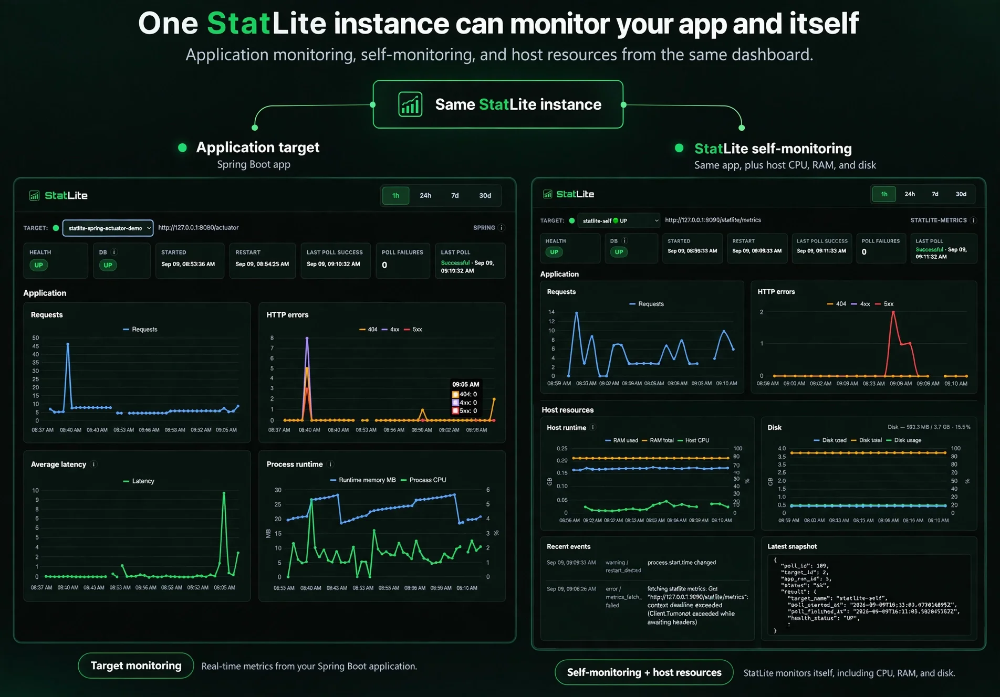
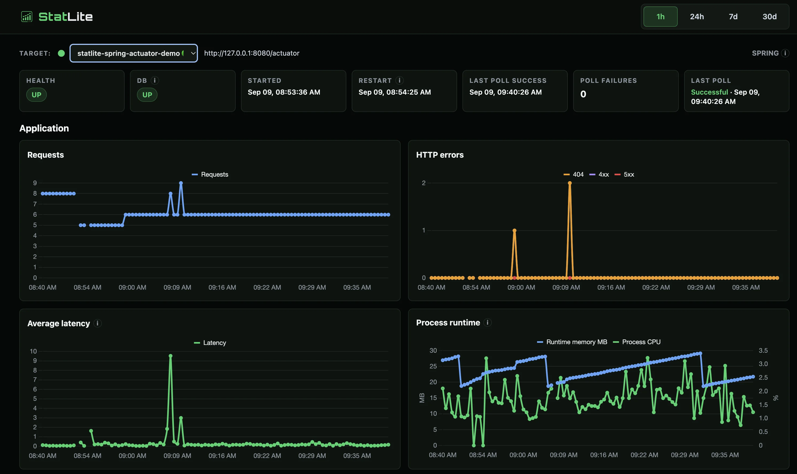
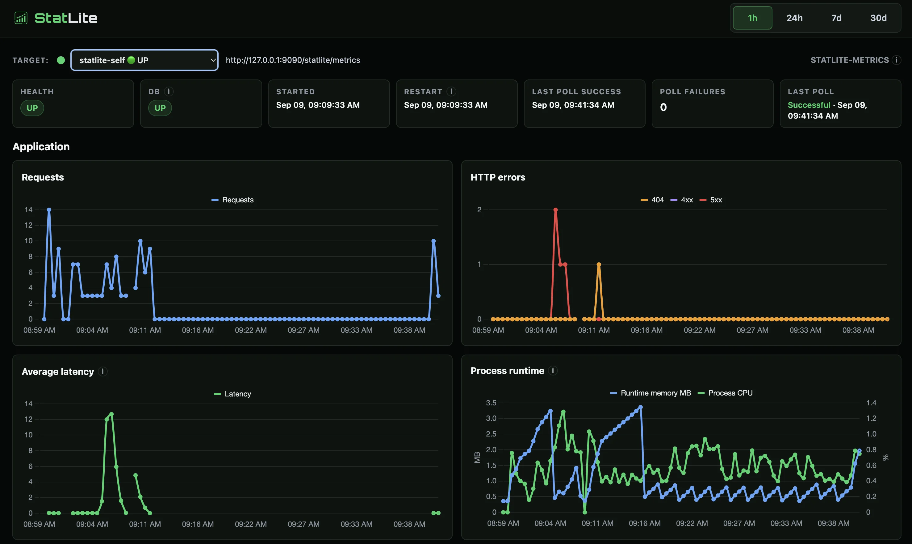
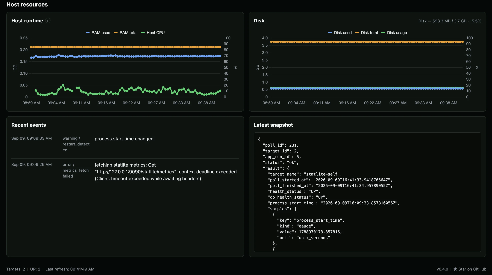

# StatLite on a 256 MB TierHive VPS



A small deployment experiment to verify StatLite's native Alpine/OpenRC
TierHive recipe on a nominal 256 MB VPS.

See the main [StatLite project](https://github.com/PVRLabs/statlite) for the
monitoring application and source repository, plus the
[TierHive deployment README](https://github.com/PVRLabs/statlite/blob/main/deploy/tierhive/README.md)
for the recipe documentation.

## Setup

The VPS ran Alpine Linux 3.24.1 on x86_64 with approximately 217 MiB of guest
memory, one vCPU, a 3.7 GiB root disk, and no swap. StatLite v0.4.0 ran as the
dedicated non-root `statlite` user under OpenRC. The dashboard and both
Actuator endpoints stayed on loopback.

The official `examples/spring-actuator-demo` application was built off-box as
a 26 MB Spring Boot fat JAR. The VPS used Alpine's OpenJDK 25 runtime and the
following constrained profile:

```text
-Xms16m -Xmx80m -Xss256k
-XX:+UseSerialGC -XX:TieredStopAtLevel=1
-XX:ReservedCodeCacheSize=32m -XX:+UseCompactObjectHeaders
```

The StatLite dashboard monitored two targets from the same instance:

- the Spring Boot application through Actuator;
- `statlite-self` through `/statlite/metrics`, providing host CPU, memory,
  disk, and StatLite runtime metrics.

## What I verified

- The native recipe installed and verified StatLite v0.4.0,
  created the normal configuration and SQLite store, enabled OpenRC, and
  passed `/healthz`.
- The Spring target first reported connection refused while the demo was not
  running, then changed to `UP` after the application started.
- The demo completed its canonical 40-request workload: 29 HTTP 200, 3 HTTP
  400, 5 HTTP 404, and 3 HTTP 500 responses.
- StatLite collected application counters, latency, JVM heap, process CPU, and
  process start time. The self target returned the `statlite-metrics/v1`
  profile and exposed host resource charts in the same dashboard.
- Restarting the demo produced a new application run and a StatLite
  `restart_detected` event. Restarting StatLite preserved the SQLite history.
- Rerunning the recipe preserved the two-target configuration and restarted
  the service successfully.

## Final dashboard evidence

The final capture shows the application target, the fixed self-monitoring
target, and the host-resource charts from the same StatLite instance.



*Spring Boot Actuator target with health, request, error, latency, and process
runtime charts.*



*The `statlite-self` target with successful polling and StatLite runtime
metrics.*



*Host CPU, RAM, disk, restart, and latest self-monitoring poll evidence.*

## Result

The answer to the experiment question is yes: one small StatLite instance can
monitor both a Spring Boot application and the VPS it runs on, with no public
Actuator listener and no second monitoring system.

The resource margin was tight. At one checkpoint, StatLite used about 14 MiB
RSS and the Java process about 121 MiB RSS. The guest reported 45.5 MiB
available memory and 6 MiB immediately free, with no swap. Disk space was not
a constraint: 3.2 GiB remained available. This is a successful deployment
check, not evidence that an arbitrary Spring Boot workload is comfortable on
256 MB.

One TierHive-specific finding was that SSH forwarding was initially disabled
(`AllowTcpForwarding no`). Enabling local SSH forwarding was required to reach
the loopback-only dashboard safely.

## Reproduce it

The cleaned-up operator sequence is in [runbook.md](runbook.md). It covers the
fresh recipe run, the expected initial failed poll, off-box demo packaging,
OpenJDK 25, the loopback dashboard tunnel, self-monitoring, traffic, service
restarts, reruns, and resource capture. It does not require Maven or build
tooling on the 256 MB VPS.
